# gan-text-to-image
PyTorch reimplementation of the paper ["Generative Adversarial Text to Image Synthesis"](https://arxiv.org/abs/1605.05396) (Reed et al., 2016).

|  Architecture  |  GAN-CLS algorithm  |
| -------------- | ------------------- |
|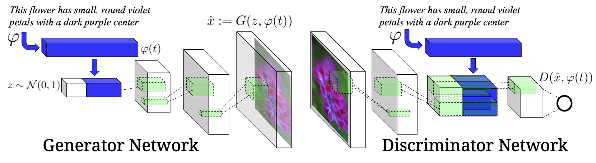 | 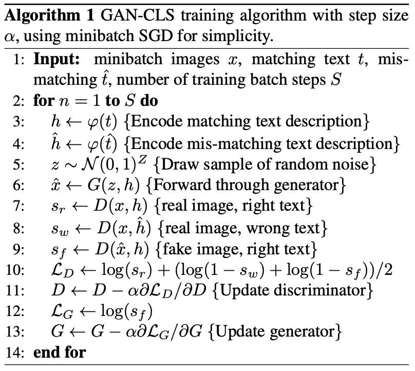 |
| Architecture of the text-conditional deep convolutional generative adversarial network. Taken from [Reed et al., 2016](https://arxiv.org/abs/1605.05396).| GAN-CLS algorithm used to train the text-conditional deep convolutional generative adversarial network. Taken from [Reed et at., 2016](https://arxiv.org/abs/1605.05396).

## Flowers102

The dataset can be downloaded from: [102 Category Flower Dataset](https://www.robots.ox.ac.uk/~vgg/data/flowers/102/).

The corresponding captions can be downloaded from: [102 Category Flower Captions](https://github.com/raphaelsenn/gan-text-to-image-synthesis/releases/latest/download/caption-data-flowers-v1.0.0.zip).

Make sure the the data directory has following tree structure:

```bash
|-- 102flowers
|   |-- images          // image folder
|   |-- captions
|   |   |-- class_0001  // captions of class_0001
|   |   |-- class_0002  // captions of class_0001
|   |   |-- class_0003  // captions of class_0001
.   .   .
.   .   .
.   .   .
```

All settings and hyperparameters and be adjusted in [config.py](./flowers/config.py).

### 1. Precompute GoogLeNet Image Features

To precompute 1024-dimensional pooling units from GoogLeNet by running the script below:

```bash
python3 ./flowers/precompute_image_features.py
```

### 2. Train Text Encoder

Run the script below to train a text encoder Char-CNN-RNN that minimizes structured joint embedding loss:

```bash
python3 ./flowers/train_text_encoder_flowers.py
```

### 3. Precompute Text Embeddings

To precompute 1024-dimensional text embeddings run the script:

```bash
python3 ./flowers/precompute_image_features.py
```

### 4. Train Text-Conditioned DCGAN

Finally, we can train the text conditioned deep convolutional generative adversarial network by running:

```bash
python3 ./flowers/train_gan_int_cls_flowers.py
```

### 5. Zero-Shot Generation

The notebook [demo_flowers.py](./demo_flowers.ipynb) illustrates an example usage.

| Caption | Ground Truth | Zero-Shot Generation |
| ------- | ------------ | -------------------- |
| this flower has yellow stamen and overlapping petals that are red on the top layer and pink on the bottom layer. |  | 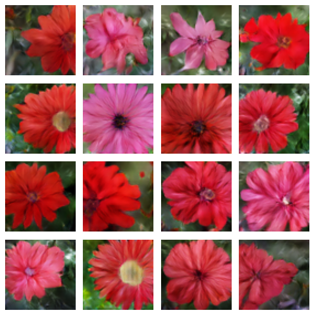 |
| a flower with thin white petals and central cluster of yellow stamen | 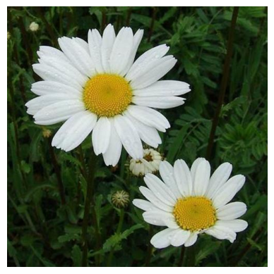 | 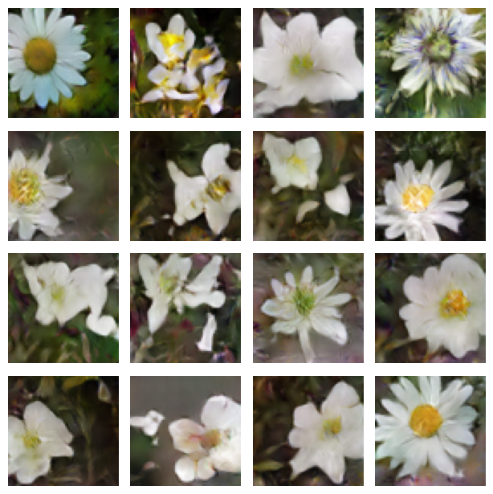 |
| this flower has orange petals that are dotted with black spots, surrounding orange and black stamens. | 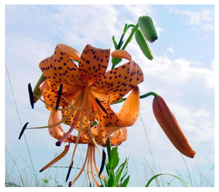 | 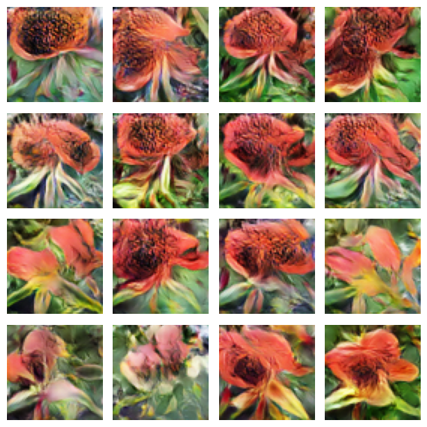 |
| this flower is pink and white in color, with petals that are striped. | 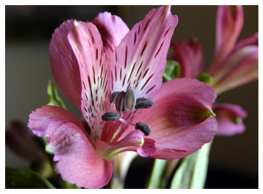 | 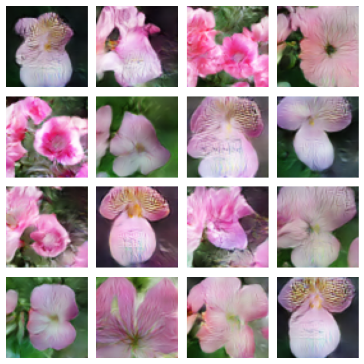 |
| the pretty flower has yellow petals that wrap around each other. | 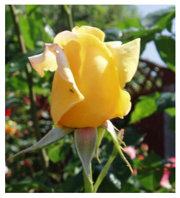 | 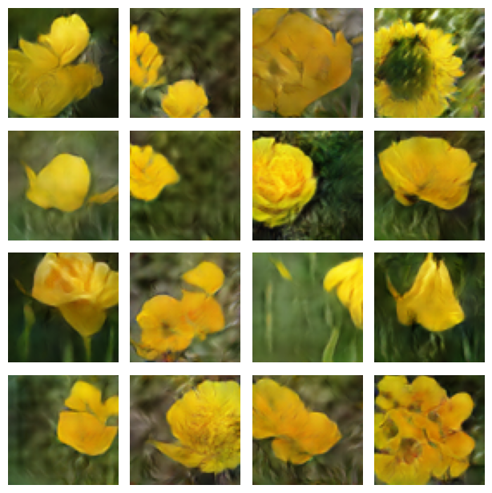 |
| pedicel is green in color,petals are oval in shape,they are light pink in color |  | 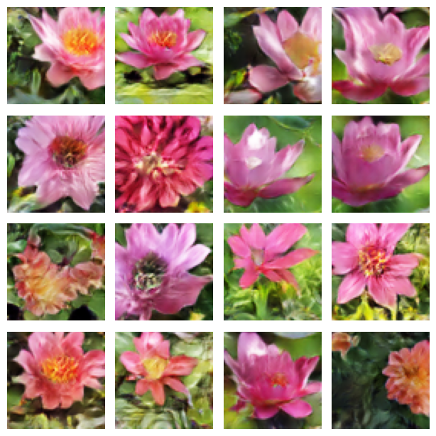 |
| a yellow and green flower with layers of petals and narrow pointed sepal. | 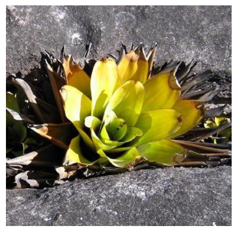 | 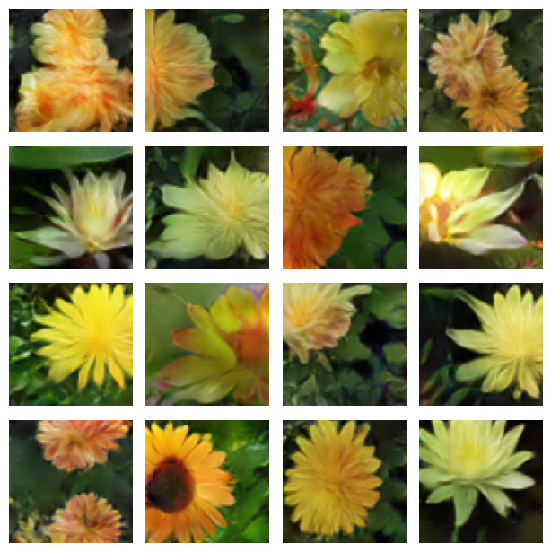 |

## CUB-200-2011 (Birds)

The dataset can be downloaded from: [Caltech-UCSD Birds-200-2011 (CUB-200-2011)](https://www.vision.caltech.edu/datasets/cub_200_2011/).

The corresponding captions can be downloaded from: [CUB-200-2011 Captions]( caption-data-cub-v1.0.0.zip).

Make sure the data directory has following tree structure:

```bash
|-- CUB_200_2011
|   |-- images      // image folder
|   |-- captions    // caption folder
```

All settings and hyperparameters and be adjusted in [config.py](./cub/config.py).

### 1. Precompute GoogLeNet Image Features

To precompute 1024-dimensional pooling units from GoogLeNet by running the script below:

```bash
python3 ./birds/precompute_image_features.py
```

### 2. Train Text Encoder

Run the script below to train a text encoder Char-CNN-RNN that minimizes structured joint embedding loss:

```bash
python3 ./birds/train_text_encoder_birds.py
```

### 3. Precompute Text Embeddings

To precompute 1024-dimensional text embeddings run the script:

```bash
python3 ./birds/precompute_image_birds.py
```

### 4. Train Text-Conditioned DCGAN

Finally, we can train our text conditioned deep convolutional generative adversarial network by running:

```bash
python3 ./birds/train_gan_int_cls_birds.py
```

### 5. Zero-Shot Generation 

The notebook [demo_birds.py](./demo_birds.ipynb) illustrates an example usage.

| Caption | Ground Truth | Zero-Shot Generation |
| ------- | ------------ | -------------------- |
| this colorful bird has a red belly and breast, black and grey wings, the bill is short and pointed, and black tarsus and feet. | 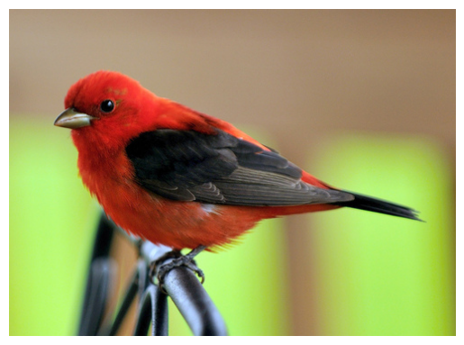 | 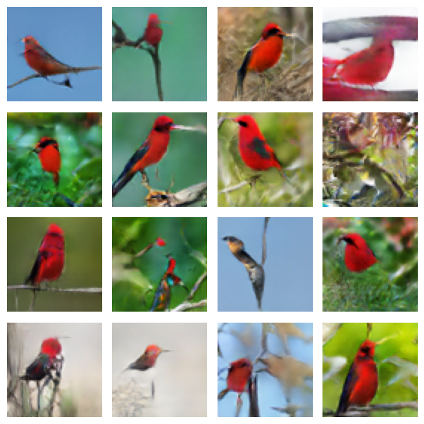 |
| a bird with a very large, pointed bill, stark white eyes, and vivid red breast. | 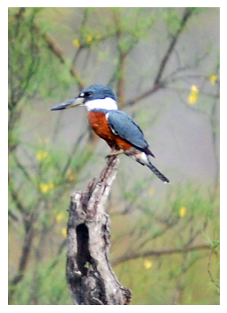 | 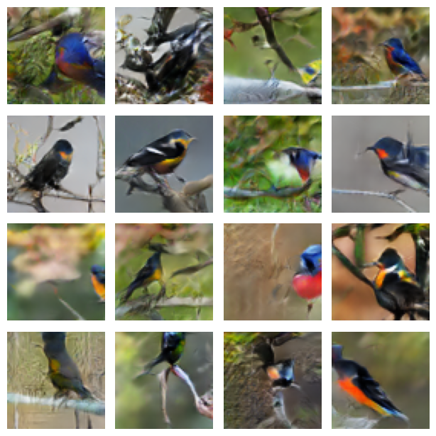 |
| this tiny yellow bird is accented with a black crown, and black wings with striking white wing bars. | 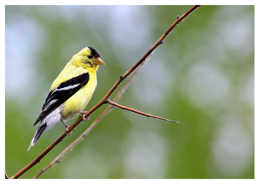 | 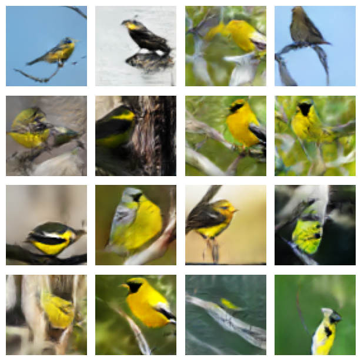 |
| this bird is completely black, with a blunt beak. | 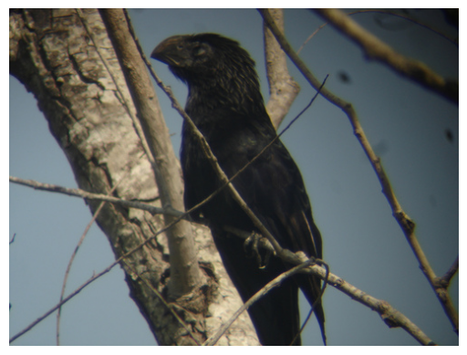 | 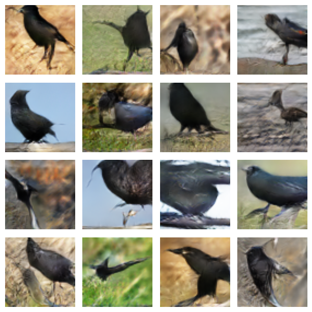 |
| this green bird has a blue crown and cheeks, black throat and long green and yellow tail feathers. | 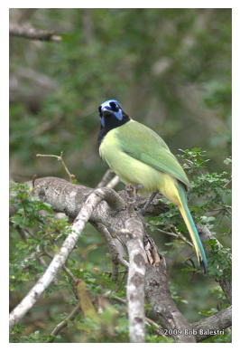 | 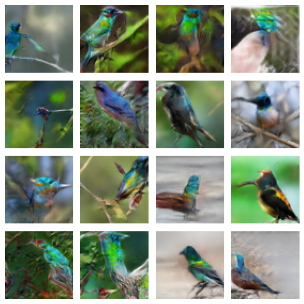 |
| the bird has a tiny yellow bill with skinny thighs. | 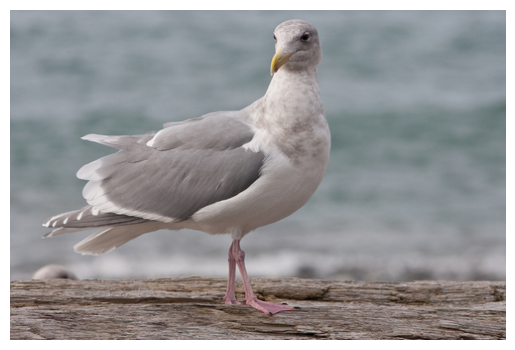 | 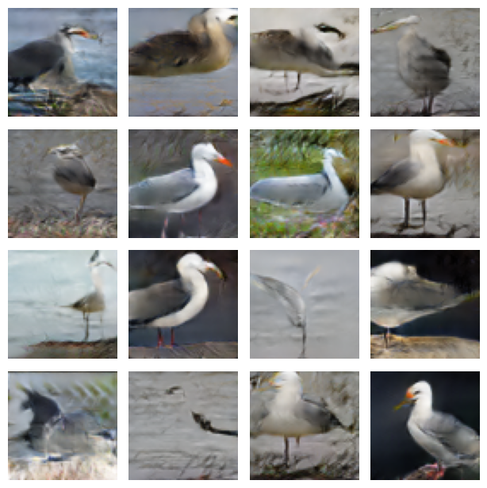 |
| this sharp billed bird has yellow feathers on the breast and belly with brown and yellow mixed on the wings. | 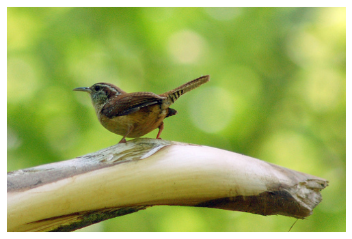 | 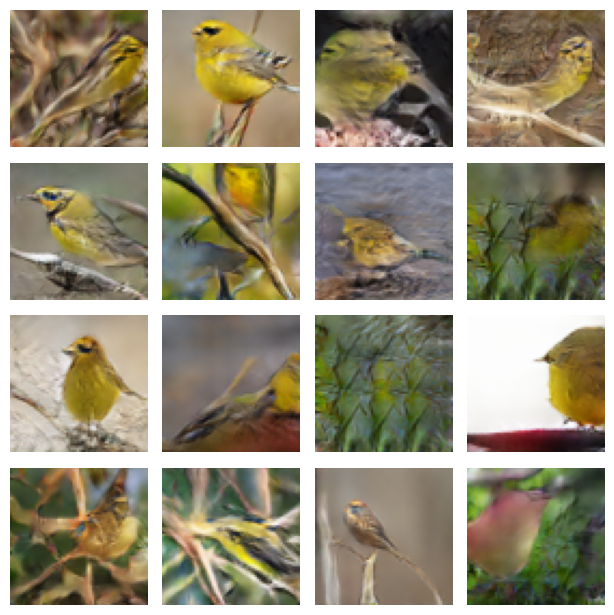 |

## Experimental setup

* OS: Fedora Linux 42 (Workstation Edition) x86_64
* CPU: AMD Ryzen 5 2600X (12) @ 3.60 GHz
* GPU: NVIDIA GeForce RTX 3060 ti (8GB VRAM)
* RAM: 32 GB DDR4 3200 MHz

## Citations

```bibtex
@misc{goodfellow2014generativeadversarialnetworks,
      title={Generative Adversarial Networks}, 
      author={Ian J. Goodfellow and Jean Pouget-Abadie and Mehdi Mirza and Bing Xu and David Warde-Farley and Sherjil Ozair and Aaron Courville and Yoshua Bengio},
      year={2014},
      eprint={1406.2661},
      archivePrefix={arXiv},
      primaryClass={stat.ML},
      url={https://arxiv.org/abs/1406.2661}, 
}
```

```bibtex
@misc{radford2016unsupervisedrepresentationlearningdeep,
      title={Unsupervised Representation Learning with Deep Convolutional Generative Adversarial Networks}, 
      author={Alec Radford and Luke Metz and Soumith Chintala},
      year={2016},
      eprint={1511.06434},
      archivePrefix={arXiv},
      primaryClass={cs.LG},
      url={https://arxiv.org/abs/1511.06434}, 
}
```

```bibtex
@misc{reed2016generativeadversarialtextimage,
      title={Generative Adversarial Text to Image Synthesis}, 
      author={Scott Reed and Zeynep Akata and Xinchen Yan and Lajanugen Logeswaran and Bernt Schiele and Honglak Lee},
      year={2016},
      eprint={1605.05396},
      archivePrefix={arXiv},
      primaryClass={cs.NE},
      url={https://arxiv.org/abs/1605.05396}, 
}
```


```bibtex
@misc{reed2016learningdeeprepresentationsfinegrained,
      title={Learning Deep Representations of Fine-grained Visual Descriptions}, 
      author={Scott Reed and Zeynep Akata and Bernt Schiele and Honglak Lee},
      year={2016},
      eprint={1605.05395},
      archivePrefix={arXiv},
      primaryClass={cs.CV},
      url={https://arxiv.org/abs/1605.05395}, 
}
```

```bibtex
@techreport{WahCUB_200_2011,
	Title = ,
	Author = {Wah, C. and Branson, S. and Welinder, P. and Perona, P. and Belongie, S.},
	Year = {2011}
	Institution = {California Institute of Technology},
	Number = {CNS-TR-2011-001}
}
```